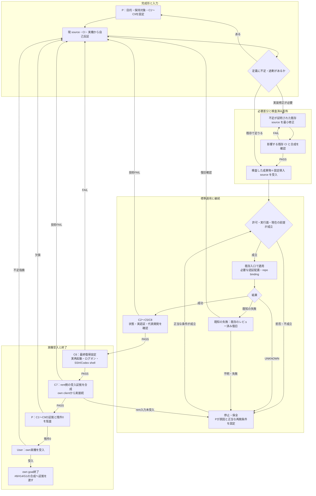

# own host + OCI の完成契約

本書は G6I3 own の完成形、完成を証明する検査、失敗・停止・再開を含む工程を一か所に定義する。
ゴールは文書作成ではなく、この定義を満たす実機受入までである。
G6I3 はサンプルであり、上位目的は、対応する別端末にも適用できる IaC・secret の境界と再現性を確立すること。

## 1. 範囲・担当・終了条件

- 対象は own Windows、`windows-own`、その開発状態と接続・ログオン復帰。
- rent の Provider/OCI 実装は別系列。own から rent を利用する client の合成に必要な成果は、その系列から受け取る。
- User の最新指定に従い、今回の担当は P のみ。P2 と旧 native Opus R/W を今回の担当・待機依存にしない。
- web.chat R/W は未擁立。P の自己監査を独立 R の判定や三者合意と呼ばない。
- 本書は実行許可・自動審査の解除・新しい actor の操作権限を追加しない。
- own の技術的な未完了が 0、実機の状態継続と再起動復帰が証明され、User が own を受け入れたときに終了する。
- #8/#14 全体の close と G1 は、rent の証拠と合成する別の終了条件である。

## 2. 小さく美しい完成形

### 2.1 数式による境界

\[
A_B = CI(Build(S, B, L))
\]

`S` は固定ソース、`B` は対応端末の Binding、`L` は固定依存、`A_B` はその入力で検査した成果物。
Binding が変われば新しい CI 成果物を作ってよい。すべての端末に同じ ZIP を使うことを要求しない。
端末へ適用するのは、その Binding で検査した成果物と固定した導入ソースである。

\[
Runtime_B = Apply(A_B, S_{apply}, B, Secret_B, State_B)
\]

`S_apply` は検査対象に含まれる不変の導入ソース参照。
秘密の値は image・Binding・文書に入れない。保存状態は image から分離する。

\[
Config = Spec_{role} \cup Binding_{target},\qquad
Packages = Profile_{shared} \cup Packages_{own}
\]

manifest は Binding の生成済み projection とする。手編集する第二の Binding を作らない。
Git の remote namespace、選択する principal、image publisher は別の値であり、相互に推定しない。

\[
N_{persistent\ volumes}=3,\qquad Writers(nix\ volume)\leq1
\]

\[
RequiredState_{after}=RequiredState_{before}\oplus DeclaredChanges
\]

必要状態には SSH key、必要な認証/session、Git refs・stash・未commit/未追跡の編集・worktree を含む。
全 HOME の byte 一致や、不要な設定の完全移植を意味しない。
own と rent は auth/session/work/nix を共有しない。

### 2.2 source dirtree と差分

`=` は既存 production 定義を使用する。今回確定した差分は本書一件だけで、package・入口・pack の実装修正は追加していない。

```text
windows/
├─ flake.nix / flake.lock                    = Build(S,B,L) の合成と固定依存
├─ .github/workflows/
│  ├─ ci.yml                               = 合成検査 → 検査した成果物を配布
│  └─ own-image.yml                        = production bind・交換・復旧・Nix の証明
├─ hosts/
│  ├─ profile/
│  │  ├─ nix.nix                           = 共通 profile; package 追加 → CI → 新 image
│  │  └─ gh.nix                            = repo の明示 principal → credential slot
│  ├─ own/
│  │  ├─ spec.json                         = role 不変条件
│  │  ├─ bindings/G6I3.json                 = target の値だけを宣言
│  │  ├─ nix.nix                           = OCI・3 volume・排他・SSH/Nix の起動
│  │  ├─ codex.nix                         = 公式 release の固定 closure
│  │  └─ win.ps1                           = Plan / Pull / Create / Replace
│  └─ common/
│     ├─ nix.nix / pack.py / test_pack.py   = Binding から Windows 配布物を生成・検査
│     ├─ win.ps1                           = 既存 Windows activation adapter
│     ├─ handoff-evaluate.ps1              = 宣言と実環境の照合
│     ├─ package-view.ps1                  = 配布 context の検査
│     └─ proof.ps1                         = Windows proof
└─ docs/
   ├─ rent-cloudflare-flow.md              = cross-repo/secret/背景の既存説明
   └─ own-completion.md                    + 今回の3成果と実機受入条件

envs/
├─ flake.nix / flake.lock                    = placement toolchain
├─ .github/workflows/check.yml              = 同一 placement 成果の検査・配布
├─ providers/dev-rent-cloudflare/main.tf    = rent の Provider と所有 state
├─ ciphertexts/
│  ├─ dev-rent-client.sops.yaml             = own/client recipient 向け
│  └─ dev-rent-tunnel.sops.yaml             = rent recipient 向け
└─ adapters/
   ├─ place.ps1                            = Windows の標準 placement
   └─ rent-receive.sh                      = rent の標準 receiver

adrs/
├─ AGENTS.md                                = 規則の入口
└─ policy/
   ├─ organization.md                      = role・目的・許可・独立性の規則
   ├─ execution.md                         = 実行面・秘密・停止の規則
   └─ control.jsonl                        = 固定契約の正本
```

今回 envs/adrs/apps/ops への新しい実装修正は未確定。
進捗用の JSONL、独自 executor、移植 helper、署名基盤、receipt framework を増設しない。
新しい不足が証明された場合だけ、責務を持つ既存 production 定義と既存検査を修正する。

### 2.3 host + OCI dirtree

```text
G6I3 Windows
├─ Codex app / Noctty / OpenSSH / WSLC       # host 固有の最小の実行面
├─ %LOCALAPPDATA%/Programs/windows-host-<source>/
│  ├─ manifest.json                        # 生成された runtime contract
│  ├─ win.ps1
│  ├─ handoff-evaluate.ps1
│  └─ package-view.ps1                      # 既存4ファイル、Task はここを参照
├─ existing user Logon Task                 # Limited、既存 OCI を起動、再作成しない
├─ ~/.ssh/
│  ├─ config                               # 宣言された alias
│  ├─ id_ed25519_windows_own                # Windows→own の private identity
│  ├─ known_hosts_windows_own               # 公開 host key の pin
│  └─ windows-rent/access                  # rent client の必要状態
└─ AppData/Local/envs/identity/
   ├─ client.agekey                        # target owner-only
   └─ rent-state.passphrase                # Provider state の復旧控え

windows-own
├─ /home/dev                    ← windows-own-home
│  ├─ existing repos/<bare>/.worktrees/*    # source/work を今回は移動しない
│  ├─ needed Codex/Claude auth/session      # package と分離した必要状態
│  ├─ .config/gh/                          # 既存元ファイルを保持
│  └─ .ssh/                                # host key / authorized_keys
├─ /work/repos                  ← windows-own-work
│  └─ .auth/
│     ├─ roccho-dev/gh/                     # 明示 principal の credential-only slot
│     └─ ssh/windows-own/                   # OCI→own の別 identity
└─ /nix                         ← windows-own-nix
   ├─ store / DB
   ├─ var/nix/profiles/own-dev              # Nix 定義の gh/Codex/Claude/tools
   └─ GC roots                             # 利用中の closure を保持
```

Windows→own と OCI→own の identity は別の Binding field。統合・再生成を追加しない。
秘密は owner-only とし、agent への値・断片・private hash の返却を要求しない。
認証は必要な初期配置・期限切れ・復旧に限る。通常の適用ごとにログインをやり直さない。
Xpra は非採用。SSH/Nix の必須起動を headless Chrome の成否に依存させない。
B2 は承認済みの画面表示まで。IME/wheel 修正や旧 NixOS 定義再利用はこの完了条件へ戻さない。

### 2.4 導入入力の閉包と小ささ

現行 ZIP に OCI 用 `hosts/own/win.ps1`・Spec・Binding が含まれないことは source 事実である。
本書の最小案は、検査済みの固定 Git commit に属する既存導入 source を入力として明示すること。
ZIP 単体への収納は必須条件ではない。branch の現在値や未検査の作業コピーで代用しない。
この固定入力を既存の工程で実際に消費できないことが証明されたときだけ、既存 pack/検査への変更へ戻る。

小ささは、code、設定正本、永続物、権限、手入力、分岐の合計で判断する。
安全・再現・必要状態の保持を落として行数だけを減らさない。
CI が繰り返す検査と配布を担い、PC は標準入口の適用と実機固有の短い受入を担う。
独立レビュー不在を省略した検証の成功に読み替えない。必要になれば新 web.chat R/W の組成を別途明示する。

## 3. 完成担保一覧

| ID | 完成条件 | 既存 CI の検証範囲 | 実機で必要な証拠 | 不合格・未完了になる条件 |
|---|---|---|---|---|
| C1 | source/Binding/依存/成果物が固定 | 別 Binding、production source、manifest、配布 byte 一致 | 取得物と対象 Binding/image/固定導入 source の一致 | mutable 入力、別成果物、対象の推定 |
| C2 | own が最終 image で稼働 | own image の build・production 起動・Xpra 不在 | Binding digest、Running、own mount gate | 旧 image、起動前、marker だけの判定 |
| C3 | 3 volume と Nix が継続 | seed/reseed、排他、foreign/中断拒否、交換/復旧、profile/GC | 3実 mount の名前/先/RW/owner、継続利用、必要状態保持 | 同時 writer、誤 mount、欠落、状態不明 |
| C4 | Git/gh が宣言 principal だけを使う | production bind/routing、9設定、再実行 no-op、競合/旧形式/誤 owner 拒否 | 実 repo の共通 Git 設定、実 `roccho-dev`、Git read と必要な権限 | namespace 推定、認証 file の存在だけ、未束縛、他 principal |
| C5 | 開発と必要状態が交換後も続く | 実 app build/run、編集・未追跡・lock・GC/offline 継続 | 代表 worktree、refs/stash/編集/CLI、auth/session/鍵の必要な継続 | HOME marker だけ、別 worktree、CLI version だけ |
| C6 | own 接続が復帰 | Windows activation・runtime/Task contract・strict SSH 設定 | actual strict SSH と Codex の shell実行、Windows再起動→ログオン→既存OCI→接続 | Task存在だけ、接続だけ、再認証/再設定が必要 |
| C7 | own client を rent と合成できる | 暗号 placement と RentSsh/client production 定義 | rent 側の受入済み endpoint と組み合わせた Access/host key/strict SSH/Codex | own local SSH を rent 成功とする、拒否理由の推定 |
| C8 | 失敗・UNKNOWN・拒否で状態を保全 | 既存 Replace の既知失敗と rollback、adapter の不一致拒否 | 既存復旧の結果と現状態、UNKNOWN の未再発火、秘密の非出力 | blind retry、volume削除、拒否を別経路で回避 |
| C9 | 必要最小の構成で終了 | 必要差分と既存検査の対応 | 新 helper/恒久物/毎回手入力が不要、C1〜C8の残件0 | 未確認を完了化、反復手順のローカル常態化 |

read 成功は write 権限の証明ではない。token 値を出力せず、既存の権限観測と必要なら限定された実作用を区別する。
CI の合格を実 SID/ACL/WSLC/実認証/実再起動の成功へ拡張しない。
完了済み B2 の全試験や VM 退役を繰り返さない。変更範囲と残る具体的なリスクに合う検査だけを行う。

## 4. 閉包された完成プロセス

各工程は、成功の次工程、是正先、停止時の保全、再開担当を持つ。
現組成では P が工程を進める。通常の技術 FAIL は目的・許可内の是正 loop に戻し、細かな P ACK を増設しない。



### 工程の実施規則

1. **現在値を固定する。** immutable source/Binding/image/対象・必要状態を確認する。旧GOの actor を自動で別actorへ置換しない。
2. **CIで足りる部分を先に閉じる。** 導入 source は固定参照を消費する。不足が実在しなければ pack や新 script を変更しない。
3. **適用は既存入口へ閉じる。** `hosts/own/win.ps1` の Plan/Pull/Replace と common adapter を使う。手組みの長い executor を導入しない。
4. **旧状態を保持して交換する。** source が要求する実 prestate とレビュー済み rollback 入力を使用する。volume を削除しない。未送信編集・実 writer の前提が変われば是正する。
5. **認証の正本を確認する。** gh companion の既存先を上書きしない。既存標準 bind で repo を束縛し、実 principal と必要権限を確認する。ファイル存在だけで認証を合格にしない。
6. **実機固有の受入をまとめる。** mount/owner、代表開発、鍵/auth/session/work、strict SSH/Codex shellを確認する。元状態と無関係な再検査を増やさない。
7. **復帰を実証する。** 標準 OwnLogon/OwnLogonTest/OwnResumeTest と、調整した時刻の Windows 再起動を使用する。Taskは既存OCIの起動だけを担う。
8. **clientを合成する。** rent の受入済み endpoint・host key・Access 契約と合わせ、ownから実際に使う。rent側の未完了をown成功と称さない。
9. **終了を監査する。** C1〜C9すべてについて同じ対象を証明する evidence を確認し、User受入を得る。別系列のG1完了を同時に宣言しない。

| 事象 | 次の処理 | 再開条件・担当 |
|---|---|---|
| 技術 FAIL | production 定義・既存検査へ戻る | Pが不足を是正し、影響範囲を再検証 |
| 自動審査の拒否 | 対象作用を発火せず既存状態保持 | Pが正当な解除・変更条件を確認。包装変更・別経路・手動代行で回避しない |
| timeout/結果 UNKNOWN | 現作用の provider 実体を再観測 | Pが結果・未作用・既存状態を確定するまで再発火しない |
| 既知の交換失敗 | 既存 rollback のみ | 復旧結果と現在の対象を確認し、是正 loopへ戻る |
| 秘密の不足・期限切れ | 標準の本人入力/保管からの復旧 | 値をchatへ送らず本人が実行、Pは成否と非秘密の一致を確認 |
| rent成果が未受入 | ownの確定済み状態を保全 | rent系列の受入可能な実証が届き、Pが同じ入力として合成 |
| 必要な独立評価がない | 単独判定として明示 | 新web.chat R/Wを採用するなら先に目的・実ID・許可・同版を明示。旧組へ黙示fallbackしない |

## 5. 基準と現在の証拠

この節は 2026-10-07 JST の観測 snapshot。将来の現在値や実行許可の代わりにはならない。

| 対象 | 固定基準・一次証拠 | 証明する範囲 |
|---|---|---|
| windows source | `e310e527fc1029f68bc228496334b909c6ddc281` / tree `be9d092b4b46d07a33d4a9debc73dc2c1deca3b2` | 現行 production 定義 |
| own image | `ghcr.io/roccho-dev/windows-own@sha256:bb918b914f07a810cf42875cbc90af591898ac26308693f5824b32baf3fdf8d5` | G6I3 Binding の最終対象。実採用とは別 |
| windows CI | [run 37416335432 attempt 2](https://github.com/roccho-dev/windows/actions/runs/37416335432) `SUCCESS` | 対象sourceの合成CI。attempt 1のdev HTTP403は保持 |
| windows 配布 | [Release 404353442](https://github.com/roccho-dev/windows/releases/tag/windows-e310e527fc1029f68bc228496334b909c6ddc281) | ZIP/sidecar/rent-image が公開。既存 byte 受入と当日のmetadata確認 |
| envs placement | `7ff0f9e1b5e219b80099b1ef33b6cbbf1aee9f38` / [run37459173589](https://github.com/roccho-dev/envs/actions/runs/37459173589) | 受入済み9job・placement Release。最新branchの別変更へ証拠を流用しない |
| policy | `c87174b4a9bfe6f4046908ce86121bbbef2e332b` | 必須4本文は以前読んだ同blob。最新Userの今回組成はP単独 |
| 実own OCI | 07:38 JST前後のnative read-only inspect: Running / 旧image `35ac544837bf5c743af46179a96fa79bb5be8721c6cf6b396ddaf6cf850d478b` | 最終image採用は未完了 |
| 実mount | home/work/nixの宣言された3 named volume、native `ReadWrite=true` | 現在のmount。final adoption/全必要状態継続とは別 |
| 実own SSH/CLI | strict Windows SSHで `dev`、Nix2.34.8、Codex0.157.1、Claude2.1.283 | 旧image上のactual実行。最終採用/Codex app shellとは別 |
| gh境界 | 元HOMEとcanonical slotの必要2fileは0600/uid1000で存在。windows repoからの `gh api user` はexit1、期待principalは未観測 | credentials消失や再loginの必要を推定しない。最終binding/実認証は残件 |
| logon Task | nativeの自分のTaskはReady、Limited、Interactive、1 OwnResume action | Task存在。実再起動/最終復帰は未証明 |
| 適用拒否 | 既存own完了turn `01a10fb8-4660-7480-8858-257ba5441d0d` のA前自動審査 `blocked by policy` / effect0 | 詳細理由UNKNOWN、同作用の迂回・再試行なし |

### 現時点の完了・未完了

| 項目 | 状態 | 次に必要な証拠 |
|---|---|---|
| 完成形・担保一覧・閉包graph | 本書で定義 | 現行sourceとの照合と文書readback |
| source/CI/公開成果 | 既存受入済み | 変更時だけ影響範囲を検証 |
| 旧own・3volume・strict SSH・CLI | 当日read-only確認済み | 同じ状態を最終採用後も確認 |
| 最終own image採用 | 未完了 | 拒否境界の正当な解消後の標準適用 |
| repo binding・実gh principal/権限 | 未完了 | 最終profileでのproduction bindと実認証 |
| 必要auth/session/work継続・実開発 | 未完了 | 同じ対象の交換前後と代表実使用 |
| Windows再起動・ログオン復帰 | 未完了 | 最終runtime/Taskとactual連続復帰 |
| own→rent client合成 | 未完了 | rent受入証拠とactual strict接続 |
| own User受入 | 未完了 | C1〜C9残件0に対する受入 |

未完了を文書化したことだけでgoalをcompleteにしない。

## 6. 既存正本への参照

- [windows #8](https://github.com/roccho-dev/windows/issues/8): own/rent Nix開発環境の合成受入。
- [windows #14](https://github.com/roccho-dev/windows/issues/14): Cloudflare/client/認可と復帰。
- [rent-cloudflare-flow.md](rent-cloudflare-flow.md): secret7分類・Provider/placement/host分担の背景。
- [own Spec](../hosts/own/spec.json)、[G6I3 Binding](../hosts/own/bindings/G6I3.json)、[own entry](../hosts/own/win.ps1)。
- [common Windows entry](../hosts/common/win.ps1)、[own proof](../.github/workflows/own-image.yml)、[共通profile](../hosts/profile/nix.nix)、[gh routing/bind](../hosts/profile/gh.nix)。

本書と既存source/契約に実際の不一致があれば、最新Userの目的・許可を基準にその一点を是正する。
説明だけでproduct sourceの意味や秘密の所有権を変更しない。
