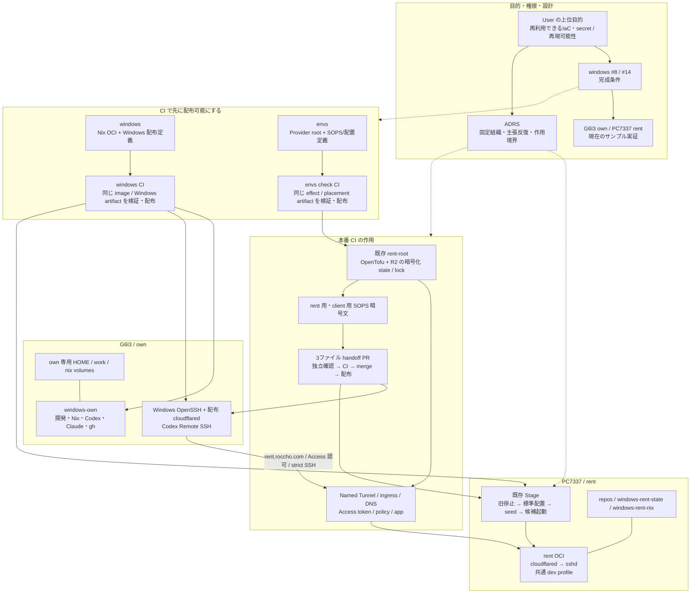
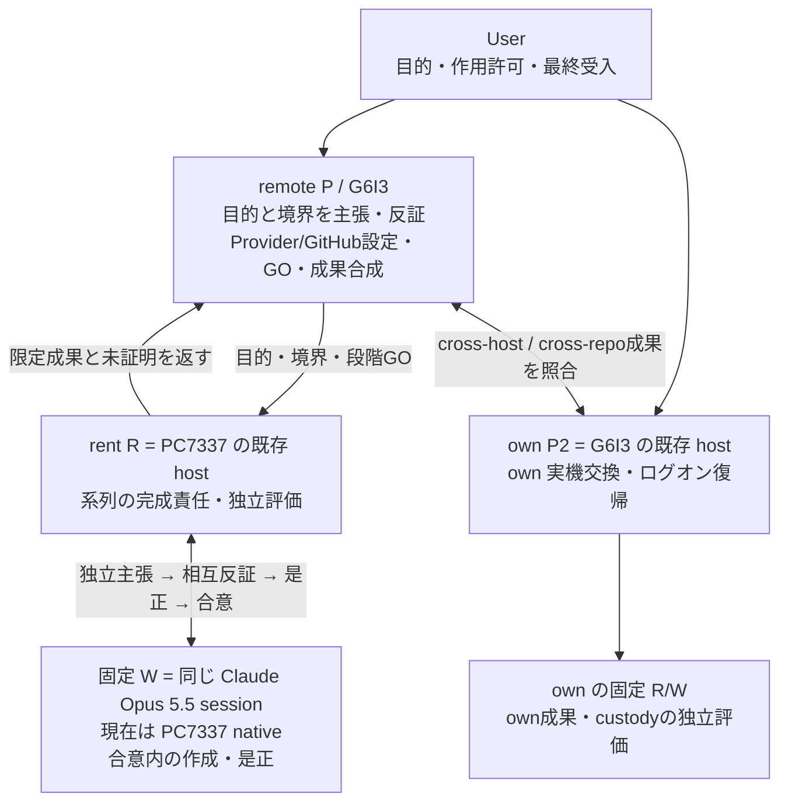
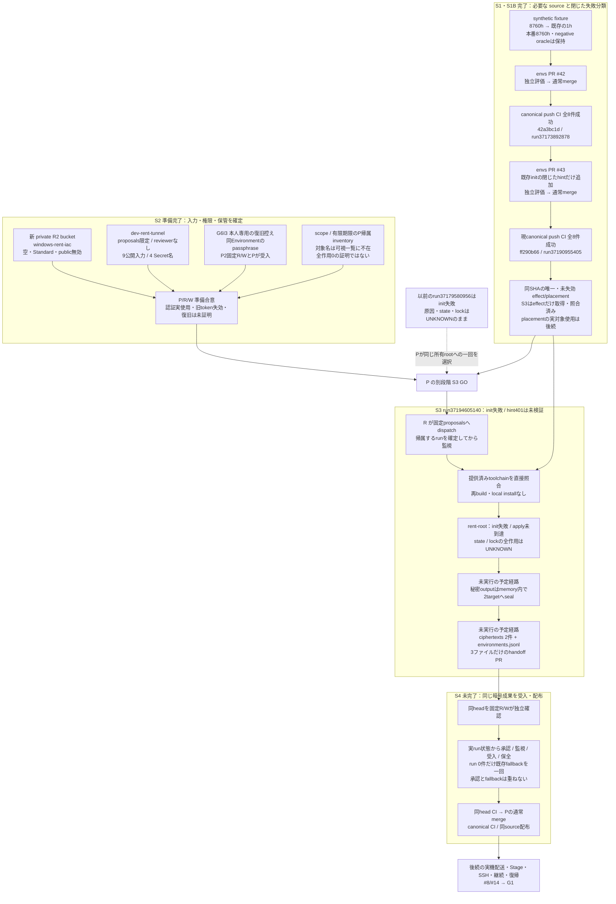
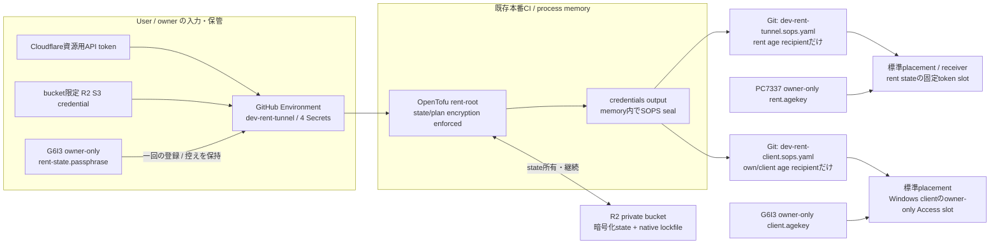
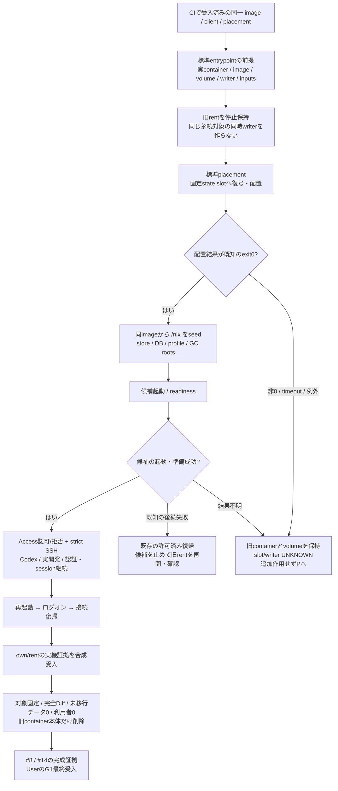

# own / rent の配布・接続・移行

## この文書の位置づけ

将来の適用先にも使える IaC と secret の管理・配置を明確にし、環境を再現可能にするための全体図と設計理由を記録する。G6I3 own/head と PC7337 rent は、これを実証する現在のサンプルである。関連する目的は [windows #8](https://github.com/roccho-dev/windows/issues/8) と [#14](https://github.com/roccho-dev/windows/issues/14) にある。

これは説明用の正本であり、実行許可や runtime の正本ではない。役割・許可は [ADRS #528](https://github.com/roccho-dev/adrs/pull/528) の canonical `95220e6ac9fa840733f318d63c45c8f17d5981b6`、特に `policy/control.jsonl` の row272（本番系列 v41）と row273（受入済みstate鍵保管）に従う。own の再利用可能な Binding と repository 束縛の source 品質系列（§7a）は ADRS canonical `1aa313608bf1043049fc019268e2936b20e6121b` の row274（v44）に従う。製品の実装は各 repository、現在の合意と証拠は対象 PR に置く。同じ図を各 repository や PR に複写しない。

**観測基準日は 2026-10-04。図の「完了」は下表の限定範囲だけを示す。** source の受入、Provider の適用、実機の成功、全体の受入を混同しない。ここに書いた段階を新しい実行前チェック列にしない。

## 1. 目的と完成形

### 目的の優先順位

User が 2026-10-04 に明確化した優先順位は、**将来の端末にも適用できる IaC と secret を明確にすること、再現可能にすることが上位で、PC7337 の実機完成はそのサンプル実証**である。PC7337 だけが動く手修正では上位目的を達成しない。

そのため、共通定義・配布成果物と、適用先ごとの入力・所有者・secret・永続状態を分ける。対応環境と前提を宣言し、別の適用先へ移るとき何を入力し、どの秘密を誰が生成・保管・登録・配置・更新・復旧・終了させるかを標準経路で説明できる状態を目指す。秘密の値は文書に保存しない。CI はその定義と配布成果物を事前に実証し、サンプル実機では標準の採用・疎通と、実機でしか証明できない継続・復帰を確認する。

これは目的の明確化であり、任意の端末・OSへの適用を実証済みとする記録ではない。現在の本番 root は `windows-rent-ssh` を固定名として使い、配布・policyにも現サンプルの入力と権限がある。この名前はrole名であり、同じ所有stateのもとで役割を別端末へ移すなら固定を保てる可能性がある。独立instanceの追加とは区別し、固定名だけを理由に入力を増やさない。現定義の境界は一つの論理rentと一つの論理clientで、複数instanceや別OSへの対応は実証していない。未確認部分を generic framework、helper、workflow の追加で先回りして埋めない。現 v41 の対象・作用許可はこの説明だけで拡張しない。

### 別の適用先へ渡すもの

| 分類 | 現在の定義・入力 | 別端末へ移る際の境界 |
|---|---|---|
| 共通成果物 | 固定sourceからCIが検証・配布するown/rent image、Windows client、effect/placement | 同じconsumerが成果物を照合する。端末で再build・都度installしない |
| Providerと所有state | account、zone、hostname、origin、duration、専用bucketとstate key | host名とstateの所有単位を混同しない。同じroleの継承と新しい独立instanceを区別する |
| targetの入力 | 適用先owner、対応環境・WSLC、role別volumeとwriter、rent/client public age recipient、各private identityの保管 | 同じ標準bootstrap・配置経路へ渡す。private identityを別hostへ共有しない。現サンプルの受入を別端末の成功へ読み替えない |
| secrets | 下記7分類と、#8が担当する開発認証・SSH状態 | 各正本・保管・配送・更新・復旧・終了の責務を選ぶ。recipient変更だけで旧端末の権限を終了したことにしない |

別端末での再現は、新規作成、保持したstateからの再作成、端末交換後の継続・復旧を区別して評価する。入力だけで表現できるか、既存CIのsynthetic入力と実機でしか確認できない証拠を分ける。台数や新しい試験基盤を増やすこと自体を受入条件にしない。

ユーザーが求める状態は次のとおり。

- G6I3 が own/head、PC7337 が rent。PC7337 の既存 host R も復旧・制御の経路として使える。
- own/rent の OCI で Codex、Claude Code、Git、gh、Nix と必要な開発 package を使える。package の正本は Nix 定義と CI 配布物に置く。
- rent の外部 SSH は Cloudflare Tunnel / Access を使い、最終 rent OCI から Tailscale・tailscaled・旧認証手順を除く。
- ローカル操作は、配布物の採用、標準の秘密配置、候補起動、疎通、切替・復帰に収める。
- 旧 OCI の必要な状態を引き継ぎ、交換後も実際の開発を継続する。旧 container の削除はその受入後に行う。
- Windows 再起動・ユーザーログオン後も、認証や SSH 設定を作り直さず接続を復帰できる。



own OCI と Windows SSH client は別の実行面である。rent の本番接続は Windows client と rent OCI の両側を実証する。own のローカル Remote SSH 成功だけで rent の成功を主張しない。

## 2. 背景と、この形に至った理由

| 背景・観測 | 採用した判断 | 維持する限界 |
|---|---|---|
| 当初は Windows/OCI の基盤、own、dev、rent、Windows 配布が別 PR で進んだ | merge commit で基盤と各系列を取り込み、単一 CI へ合成した。必要な系列の履歴と検査を保つ | コード統合だけでは実機移行・認証・G1 は完成しない |
| Tailscale のブラウザー承認後も daemon が `NeedsLogin` のままになり、URL再利用や一時キーでは netmap 受信を実証できなかった | #14 を Cloudflare の完成形へ改め、Tailscale を最終 rent に残さない | 特定の失敗原因や、別方式なら必ず成功することは証明していない |
| exact な手入力契約、Base64 transport、ローカルの鍵移送・receipt・手動 hash gate が増え、no-effect 停止が続いた | 再利用する標準経路へ不足を戻す。CI 配布物を直接検証する既存 consumer に寄せ、ローカルの独自手順を増やさない | Provider と実機でしか確認できないことは残る。事前 CI がそれらの成功を保証するわけではない |
| 旧 own の Xpra display 100 失敗が exit23 を起こし、SSH まで止めた | Xpra を完成形から除き、SSH の起動を不要な headful/Xpra 処理に依存させない | source/CI の修正受入と own 実機交換・ログオン復帰を分ける |
| Noctty から OCI headless Chrome の画面は表示できたが、日本語入力・wheel 等に cdp-tty 側の不足があった | B2 は「画面表示まで」で User 受入済み。cdp-tty の修正は別 Issue の対象とした | 操作全般が完成したとの主張や、Xpra の再採用理由にしない |
| 旧 `envs-dev-mutable` には rootfs 内の作業もあり、named volume があるだけでは保全を証明できなかった | retained container の rootfs と named volume を区別し、旧本体を受入まで保持する | 停止と削除は違う。`envs-*` 全体を名前だけで削除しない |
| rent の HOME 全体を残すと package・資格情報・session の正本が混ざる | HOME は新しく作り、必要状態を型付き state/work/nix へ置く。`dev-home` を最終 rent の mount にしない | 不要とされた旧 settings/skills/plugins を完全移植することを今回の完成条件に戻さない |
| 旧 R2 試験は positive/negative と bucket 不在を確認したが、資格情報終了の期待401に対して403となった | 実結果を保持し、資格情報終了・cleanup/status は UNKNOWN とする。本番系列の専用 backend を別に用意する | 「bucket がない」から「資格情報も終了した」と推定しない。旧試験を自動再発火しない |
| 本番 token の成功 modal が一覧 URL に残り、P の広い画面読取に値が混入した | User が該当 token を同権限・有限期限で再発行し、Secret を更新した。以後は modal 不在と非秘密の表示範囲を先に確認する | 更新時刻は値一致・失効・認証成功の証明ではない。露出の履歴を消さず、旧 token 失効の独立実証は未確認として残す |

VM の保存対象は User が age key のみとし、nixos-vm 退役と保存は完了として受入済み。旧 NixOS 定義を将来 OCI の Nix 定義へ再利用する希望は #8 に残すが、今回の本番系列を止めない。これを rent のデータ削除許可へ拡張しない。

## 3. Nix・Windows 定義・OpenTofu・SOPS・R2 の役割

| 要素 | 正本・責務 | この選択の理由 |
|---|---|---|
| Nix | 共通 dev profile、own/rent OCI、固定 package、effect/placement toolchain、Windows 配布物 | ローカル install の差を減らし、同じ source から検査・配布できる |
| Windows の PowerShell 定義 | 配布物の採用、client 設定、秘密 slot、WSLC の Stage/復帰・ログオン処理 | Windows 固有作用を既存の小さな native adapter に閉じる |
| OpenTofu | `providers/dev-rent-cloudflare/main.tf` の Cloudflare 資源と所有状態 | API 操作を一つの既存 root へ集め、state/lock と対応づける |
| GitHub Environment | 本番 CI の公開入力と User が直接登録する credential、state passphrase | 値を agent に渡さず、許可 branch を `proposals` に限定する |
| R2 | OpenTofu の暗号化 state と native S3 lockfile | 実際に作った資源・秘密・所有状態を継続して管理する backend。既存の標準 S3 backend を使う |
| SOPS / age | rent と client へ渡す、受信先を分けた暗号文 | Git で検査・配布する対象設定を、target の private identity だけで復号できるようにする |

**R2 は GitHub や SOPS の代替ではない。** GitHub には定義と target 向け暗号文、R2 には Provider の暗号化された mutable state を置く。Provider state にも tunnel/client の秘密が入り得るため、`sensitive` 表示だけに頼らず、native state/plan encryption を強制する。

`AWS_ACCESS_KEY_ID` / `AWS_SECRET_ACCESS_KEY` は R2 の S3 互換 backend へ渡す既存の標準名であり、AWS の account を新設する意味ではない。API token は Cloudflare 資源操作用、R2 の S3 credential は専用 bucket の state/lock 用で、用途が異なる。

現在の [Windows common 定義](../hosts/common/README.md) は Nix を選択・pin の正本、PowerShell を activation adapter とする。DSC backend は採用していない。この文書でも「IaC はすべて DSC」とは表現しない。

## 4. 固定組織と合意の意味



合意は、三者が目的を再確認し、独立に主張し、反証と是正を反復して収束した状態を指す。人数、ACK、過去の合意、同じ hash の提示だけでは代替できない。P 自身も主張主体であり、R を単なる報告・伝言役にしない。

R は W の成果と工程を独立に評価し、同じ合意の中で必要な是正と後続工程を進める。目標・権限・作用境界が変わる場合や、結果が UNKNOWN の場合は P へ戻す。待機するたびに User の一般的な「了解」を要求しない。

session は固定する。現在の native W を最終 rent OCI 内の W と同一視しない。最終 OCI での実作業・認証/session 継続と役割引継ぎは runtime 受入で扱い、新 session や actor を黙示追加しない。own P2 の実機作業を remote P/R/W が重複実行しない。

## 5. 本番系列 S1・S1B → S2 → S3 → S4



S1 の fixture 是正は合成検査の不足を埋める最小変更で、実入力や gate を緩める変更ではない。S1B の [envs #43](https://github.com/roccho-dev/envs/pull/43#issuecomment-5978462562) は既存initの失敗時に閉じた未検証hintを返す2ファイルだけの変更で、原因を確定するprobeや別workflowを足していない。現配布元は canonical `ff290b66`／[run37190955405](https://github.com/roccho-dev/envs/actions/runs/37190955405) の全8件成功と同sourceのeffect/placementで、以前の成果物を新sourceへ読み替えない。S3 は既存 [project-dev-rent-tunnel.yml](https://github.com/roccho-dev/envs/blob/ff290b66a5cb88373ad7eb401ca568876a69fa29/.github/workflows/project-dev-rent-tunnel.yml) を使い、effectだけを取得してidentity・digest・実bytes・`SOURCE`・entryを照合する。placementは同sourceのCI検査・配布受入までで、S3で取得したとは記載しない。実対象の配置は後続consumerの別受入である。policyや文書へhashを転記して別gateを作らず、S4のPRをdocsの保存用に拡張しない。

以前のrun `37179580956`（source `42a3bc1d`）でPが観測した閉じた失敗分類は `RENT_ROOT=RED: envs at init`。その固定sourceの [rent_root](https://github.com/roccho-dev/envs/blob/42a3bc1d3192f0d5049a8c7b962d00e8eb0c66e4/adapters/jev_api.py#L1050) は `init` が成功してから `apply` へ進むため、このrunは適用処理に到達していない。ただし、初期化の根本原因やbackendへの全作用まで判明したことにはならない。失敗後にPが見たbucket一覧は空だったが、それだけでstate/lockを含む作用全体をゼロとは断定しない。

v41はこのUNKNOWNを残し、Pの可視inventoryで衝突が観測されていないことを根拠に、同じ所有bucket/key・宣言rootで標準reconcileを一回選ぶ。native applyはcreate-onlyではない。新しいstate・resource・lock・競合をdispatch前に観測すればPへ戻り、adopt・reset・unlock・cleanupは行わない。Pはpreflightからhandoff PR読戻しまでenvs proposalsへのmergeを止めるが、外部writeがない証明にはしない。S3の一つのworkflowには3ファイルのverify・owner commit・non-force push・PR生成も含め、ローカルの手順を増やさない。S4は実際のCI状態を見て別GOで承認・監視・受入を選び、runが0件の場合だけ既存fallbackを一回使う。承認とfallbackを重ねない。

v41の[run37194605140](https://github.com/roccho-dev/envs/actions/runs/37194605140)は固定`ff290b66`・proposals・attempt1に帰属し、artifact/toolchain通過後、root stepで失敗した。Pはその名指しstepの閉じた2行だけを既存UIで観測した：`RENT_ROOT=RED: envs at init`、`RENT_ROOT_INIT_HINT_UNVERIFIED=status=401 access_denied=false transient=false`。raw child、state/plan、secret値やhashは読んでいない。verifyとhandoffはskippedで、S3の一回は消費済み。401は未検証の文字パターンであり、R2や特定の資格情報への原因帰属、作用ゼロの証拠にはしない。Pは固定R/Wの最小入力確認案を受入済みで、値を尋ねないUser回答を待つ。v41は設定変更や再実行を許さず、訂正は新しい限定契約で扱う。

Provider の run 失敗や runner 消失では、PR が作られなくても資源・state・lock が残り得る。自動再実行、import、destroy、rollback、資格情報削除、force-unlock を行わず、非秘密の実際の段階・資源を読んで P が回復境界を判断する。

## 6. 秘密の流れと保管先



### 本番配布・接続系列のsecret 7分類

| 分類 | 生成・権限・正本／保管 | 登録・配布・配置 | 更新・復旧・終了の責務 | 根拠と未証明 |
|---|---|---|---|---|
| Cloudflare API token | User/ownerが対象account・zoneの必要scopeと有限期限で発行 | `dev-rent-tunnel` の `CLOUDFLARE_API_TOKEN`へUserが直接登録。CIのProvider childだけで使用 | ownerが同権限の再発行・Secret更新・旧token失効を担当。値をagentへ渡さない | scope・期限・登録metadataを受入。本番認証、旧tokenの独立失効確認は未証明 |
| R2 S3 key pair | User/ownerが専用bucket限定Object Read/Writeで発行 | 同Environmentの `AWS_ACCESS_KEY_ID` / `AWS_SECRET_ACCESS_KEY`。native S3 backendのstate/lock用 | ownerが期限更新・必要な再発行と登録を担当。再発行時はpairを揃える。Secret Access Keyは作成後再表示できず、本人の保管組の照合と新規発行を区別する。実復旧・終了は別証拠 | bucket/private/入力準備を受入。S3実使用と旧試験の資格情報終了は未証明 |
| state passphrase | P2の固定Wが32 random bytesを64 lowercase hexへ変換。G6I3の本人専用 `C:\Users\resta\AppData\Local\envs\identity\rent-state.passphrase` が復旧控え | 同じfile bytesを一回だけ `RENT_STATE_PASSPHRASE`へ登録。OpenTofu state/plan encryptionに使用 | ownerが現keyと復旧控えを保持。本番rootの標準rotation・旧key移行は未定義／未実証で、盲目的な値変更をしない | 単一生成・file読戻し・送信・ACLと登録metadataを受入。本番使用・fileからの復旧は未証明 |
| rent private age identity | PC7337 target ownerの本人領域 `AppData/Local/envs/identity/rent.agekey`。private identityはそのtargetが保管 | public recipientだけを `RENT_AGE_RECIPIENT`へ登録。rent ciphertextを標準placementで復号 | 新targetは自身のidentityを持つ。recipient更新・再sealの候補経路はあるが、旧identityや旧targetの権限終了とは別 | bootstrap配布元・ACL・public `-y`一致を受入。本番配置・交換後継続・秘密復旧は未証明 |
| client private age identity | G6I3 target ownerの本人領域 `AppData/Local/envs/identity/client.agekey`。rent identityとは別 | public recipientだけを `RENT_CLIENT_AGE_RECIPIENT`へ登録。client ciphertextを標準placementで復号 | 新clientは自身のidentityを持つ。現定義はclient recipient一つ。複数clientや旧clientの失効を実証したとは扱わない | bootstrap限定受入済み。実Access利用・交換・復旧は未証明 |
| Tunnel token | Cloudflareが論理rentに発行。Provider outputと暗号化stateが管理し、CIがmemory内でseal | `dev-rent-tunnel.sops.yaml` → rent identity → 標準receiverの固定state slot | Provider-issued credentialの更新・失効はrole ownerの責務。新recipientへ同じoutputを再sealしても旧targetのtokenは失効しない | source/CIのseal・receiverを受入。実発行・配置・continuity・旧新overlap・終了は未証明 |
| Access service token pair | Cloudflareが論理clientにClient ID/Secretを発行。Service Auth policyはそのtokenだけを許可 | `dev-rent-client.sops.yaml` → client identity → `win.ps1 -Mode RentAccess` → ownerの `%USERPROFILE%\.ssh\windows-rent\access` | ownerが期限・更新・失効を管理。現rootに強制rotationの標準entryはない。新recipientへの再sealだけで旧clientを排除しない | source/CIの暗号配布・owner slotを受入。本番認可／拒否・更新・旧権限終了は未証明 |

Provider stateの現在のbindingは account `3d17cd263c27a0ea241f0a8fc09ac2bb`、bucket `windows-rent-iac`、key `cloudflare/windows-rent.tfstate`。sourceはdefault jurisdictionの `https://<ACCOUNT_ID>.r2.cloudflarestorage.com` を使い、他jurisdictionへ適用済みとはしない。これはサンプルの所有stateであり、hostの置換だけで新しいstate keyを勝手に作らない。暗号化state/lockの実作成はS3の未完了実証である。[R2公式仕様](https://developers.cloudflare.com/r2/api/tokens/)

この7分類は本番Provider・暗号配布・外部接続の範囲。gh、Codex、Claudeのログイン状態とSSH private状態は#8の型付きruntime state／owner bindingが担当する。Nix package配布だけでログイン・資格情報移行・session継続を完了にせず、実機交換の既存系列で配置・保全・継続・旧所有者の扱いを確認する。

Provider-issuedの論理role credentialは、sourceの再seal時に同じoutputを引き継ぐ可能性がある。private age identityを共有しない設計と、role credentialの継続・重複・失効の実証を区別する。現在の `rent_root` はapply後にoutputを再sealする候補経路を持つが、再apply・旧targetの排除・復旧はまだ実証していない。

User の provider credential は Environment へ直接入力する。秘密値・値の hash・断片を agent に渡す経路を設けない。R/W は GitHub の Secret名・更新時刻だけを独立に読む。P の Cloudflare UI観測は P に帰属させ、R/W 自身の直接観測とは記録しない。

有限期限の親credentialと、生成される Access service token の `8760h` は別の寿命である。親credentialは現在 API用が2027-01-03、R2用が2026-11-03まで。毎回ブラウザー認証をやり直す運用を完成形にしないが、期限後の更新・rotationやowner-file復旧が成功済みとも主張しない。

## 7. 完成形の配置と保存する状態

以下は合意済みの完成形と実装上の配置であり、実機への全採用済み一覧ではない。

```text
G6I3 (own/head)
├─ Windows: 配布済み OpenSSH client / cloudflared / client Access slot
├─ AppData/Local/envs/identity/
│  ├─ client.agekey                 private / owner-only
│  └─ rent-state.passphrase          private / owner-only / 復旧控え
└─ windows-own
   ├─ windows-own-home → /home/dev
   │  ├─ repos/{adrs.git,envs.git,windows}   現在の作業repository（移動しない）
   │  ├─ .config/gh/hosts.yml        元のHOME gh資格情報（保持）
   │  └─ .ssh/                       host秘密鍵（secret）/ authorized_keys（public）
   ├─ windows-own-work → /work/repos
   │  └─ .auth/<github-owner>/gh     owner別のgh資格情報（0600）
   └─ windows-own-nix → /nix          store / DB / own-dev profile / GC roots

PC7337 (rent)
├─ 既存 host R / 固定 native Opus W
├─ AppData/Local/envs/identity/rent.agekey   private / owner-only
└─ rent role OCI
   ├─ repos → /work/repos
   │  ├─ <bare>/.worktrees/*
   │  └─ .auth/<github-owner>/gh
   ├─ windows-rent-state → /var/lib/rent
   │  ├─ SSH / Tunnel の型付き状態
   │  └─ dev/{codex,claude,claude.json}     必要なdev継続状態
   ├─ windows-rent-nix → /nix              store / DB / profile / GC roots
   └─ /home/dev                           新規HOME、volume mountなし
```

通常の rent 名は `windows-rent`、既存 Stage の候補実名は `windows-rent-cf`。Stage 成功時は候補を起動し、ログオンtaskもその候補へ向け、旧 `windows-rent` を停止保持する。候補名・role名・現在の実機名を混同しない。最終名まで統一済みとの主張は未実証であり、見た目のためだけの再作成をここで追加しない。

`dev-home` は移行元を読む既存 Migrate の入力としてだけ残り、最終 rent に mount しない。package は HOME に都度 installせず、Nix の固定定義から配布する。Codex/Claude は公式 release を hash固定、gh等は固定nixpkgsを使う。host間で資格情報・session・work・`/nix` を共有しない。

`.auth/<github-owner>/gh` は資格情報の保管rootであり、repositoryのlocal bindingがowner helperを選ぶ。裸repo・worktreeの配置やPATHだけで、別ownerの認証を自動選択したことにしない。[共通 gh 定義](../hosts/profile/gh.nix) と ADRS の Git/authority規則へ従う。

## 7a. own の再利用可能な Binding と repository 束縛

**目的。** 適用先ごとの値を own の Binding（現在のサンプルは [`hosts/own/bindings/G6I3.json`](../hosts/own/bindings/G6I3.json)）だけに宣言し、Windows 配布の manifest、pack/evaluator の検証、runtime guard、SSH alias と gh owner の選択がすべて同じ宣言を読む。G6I3・`wslc-cli-resta`・`g6i3-own` は宣言値の一例であり、共通 source の前提ではない。対応範囲は native x64 Windows で、対応外の owner・形式は拒否する。

| 区分 | 置き場所 | 例 |
|---|---|---|
| 適用先の値（Binding） | `expectHost`、credential `owner`、`session`、`sshAlias`、`container`、`hostPort`、3 volume、`windowsIdentityFile`、`knownHostsFile`、OCI/dev→own の鍵 file、`image` | G6I3 の現在値 |
| role の不変条件（Spec・profile） | image publisher（`imageRepository`）、container 内の SSH/CDP port、3 mount 先、共通 dev profile | own role 共通 |
| secret | Windows SSH 秘密鍵、own host 秘密鍵、owner root の gh 資格情報 | 文書・Binding・image に値を置かない |

credential owner と image publisher は別の値である。Windows→own の SSH identity と、OCI/dev→own の鍵は別 field として扱い、統合・再生成しない。known_hosts は公開の pin である。

**標準の repository 束縛。** 追加の executable は作らず、既存の owner credential helper の `bind REPO URL` を使う。native Git が local の7設定（credential.helper の reset、URL と URL.git の owner helper、useHttpPath、redirect 無効、origin と push URL）を書く。所有者の異なる clone、worktree config、include、想定外の credential/http/url 設定、異なる値・重複値、URL/URL.git 以外の origin は書く前に拒否する。既に束縛済みなら何もしない。既知の失敗は、同じ呼び出しの中で、その呼び出しが書いてまだ変わっていない値だけを戻す。不明な結果は保持して報告し、後から任意の過去設定を戻す汎用 Unbind は持たない。dev Tools は結果行と7設定の独立な読戻しを両方要求し、`bind` を持たない古い helper の exit 0（効果なし）を成功にしない。

**最小の証明。** CI では own image job が毎回、production `bind` の正常・再実行・誤った呼び出し・競合・想定外設定・同一呼び出し内の復元と、束縛 clone だけで owner 資格情報を選ぶ routing oracle を実行する。CI 専用の別 owner の gh 出力で routing と他 owner の拒否、test_pack の別 Binding で G6I3 値へ fallback しないこと、dev proof で計画どおりの Tools 断片と古い helper の拒否を示す。実際の SID・ACL・WSLC・実認証の principal と push 権限・Git read・default exec・logon・再起動は CI では証明できず、別に許可された実機採用で確認する。

**短い手順。** 初期配置は、許可された保管済み資格情報の配置か、選択された owner root での native `gh auth login` を一度だけ行う。更新は要求時・期限切れ時の `gh auth refresh`、復旧は保管からの復元か再認証で、毎回の適用では認証し直さない。`gh auth logout` は local の削除だけで provider 側の失効ではない。束縛は、既存の厳格 SSH 経路で `/nix/var/nix/profiles/own-dev/bin/git-credential-github-<owner> bind <repo> <url>` を repository ごとに一度実行し、再実行は no-op となる。dev の `toolsRev` は、公開後に実際に `bind` を含む commit へ同じ PR の中で合わせる。

この source 系列は own v10 の保留中の実機作用を再開しない。実機の image・Release 採用、束縛、検証、再起動はそれぞれ別の許可で行う。

## 8. 実機に残す最小作用と失敗時の境界



これは操作許可ではない。S3/S4のGOから Stage・停止・再起動・削除へ進めることはできない。実機の停止window、他task、current writer、復帰権限をその境界で確定する。

現在の [rent Stage](../hosts/rent/win.ps1) は WSLC が必要なmount情報を示さない場合を保守的に扱い、候補以外のcontainerも provably stopped であることを要求する。目的上の「異なる永続対象なら並行可能」と、現entrypointがそれを判定できることは別である。ここを手動推測や新しいローカルhelperで回避しない。

配置が UNKNOWN なら、旧rentが停止していても勝手に再起動せず、slot/writerを保全して回復判断へ戻す。既知の配置成功後の候補失敗と、配置自体が不明な失敗の復帰を同じものにしない。

削除は受入後に実containerを固定して行う。旧rootfsの追加・変更・削除まで完全に照合できない場合は UNKNOWN。named volumeとimageは削除しない。「envsという名前だから不要」「新しいOCIが存在するから移行完了」という偽陽性を避ける。

## 9. 何が小さく、美しく、高品質なのか

これは評価基準であり、現在の未完了を美化する結論ではない。

| 評価基準 | この構成で達成すること | 膨らませないための制約 |
|---|---|---|
| 正本が一つ | packageはNix、作用は既存entrypoint、目的は#8/#14、role/許可はADRS | 図はこのfileへ集約。独自runtime台帳・並列した設定正本を増やさない |
| 適用先を変えられる | 共通定義を保ち、端末ごとの入力・owner・secret・永続状態だけを明示して採用する | 特定PCだけの手修正や隠れた前提を残さず、実際に必要な不足だけを既存定義・CIへ戻す |
| 同じ成果物を使う | 検証したsource/image/artifactをそのままconsumerへ渡す | ローカル再build・都度install・手で転記したhashをgateにしない |
| 一つの責務に一つの標準経路 | Providerはrent-root、秘密はSOPS/placement、Windows作用はnative adapter | 新workflow・転送helper・scanner・receipt frameworkを追加しない |
| 変更が目的に直接寄与 | fixture一行、既存initの閉じたhint、既存production/3-file handoffで閉じる | 意味のないscaffold PR、枝を整えるだけのrebase、完了済み試験の再実行を避ける |
| 状態が明確 | state/work/nixを分け、同じ永続対象のwriterを一つにする | HOME全体の移植、host間の認証共有、rootfsとvolumeの混同をしない |
| 独立性が保たれる | Wが作成・是正、Rが直接評価、Pが境界と合成を評価 | Rを報告役にせず、Pの要約だけでR/Wの読戻しを代用しない |
| 成功と不明を区別 | source / metadata / Provider / runtime / G1 を別の証拠で示す | CI successやSecret名presenceから実認証・SSH・復旧を推定しない |
| 失敗時にさらに小さく戻る | 実物を保持し、不足を定義・CIへ戻して一箇所を直す | UNKNOWNにblind retry、force-unlock、広い削除、恒常復旧helperを重ねない |

Provider運用にはstateの保管、lock、期限更新、target側のprivate identityが必要で、その責務自体は消えない。小ささは、必要な責務を既存の一つの経路に閉じ、同じ不足を各hostで別々に直さないことで評価する。

## 10. 現在の完了・未完了

| 系列・境界 | 担当 | 2026-10-04の現在地 | 残件 |
|---|---|---|---|
| 基盤・単一CI・own/rent/dev/Windows source | 各既存系列、remote P合成 | 統合済み | 実機の完了とは別 |
| 別端末への再現契約 | remote P・固定rent R/W、own P2の関連証拠 | 目的理解と最小のA〜D系列、Aのlifecycle説明をP/R/Wが相互反証・原文readbackして受入。現サンプルの受入は保持 | 再現・交換・復旧の実証は未完了。PC7337の成功だけで完了にしない |
| B2 表示限定 | own、User受入 | 完了 | IME/wheel等は別scope |
| VM退役・age key保存 | 既存担当、User受入 | 完了 | 再実施しない |
| own image/復帰 source | own P2固定R/W | source/CI受入済み | 実機採用・再起動・ログオン復帰は別受入 |
| own 再利用 Binding・production bind（§7a） | own P2固定R/W、remote P | v44 の source 系列で作成中。CI・受入は未確認 | dev `toolsRev` の実commitへの整合、実機の束縛・検証・再起動は別許可 |
| S1 本番 fixture/source | rent固定R/W、remote P | PR #42／canonical `42a3bc1d`／push CI全8件で完了 | 旧S3のeffect取得・照合は通過。現配布元はS1Bの同source成果物 |
| S1B init失敗の閉じたhint | rent固定R/W、remote P | PR #43／canonical `ff290b66`／push CI全8件と同source配布物をP/R/W受入済み | hintは原因・認証・実Providerの精度の証明ではない |
| target age bootstrap | rent固定R/W・own P2固定R/W | 配布元一致・ACL・public recipient一致で完了 | private鍵での本番配置は後続 |
| state passphrase custody | own P2固定R/W、remote P | owner-only fileと同Environment登録を受入済み | 本番使用・実復旧は未証明 |
| S2 入力・backend準備 | remote P、User、rent固定R/W | 9公開入力、4 Secret名、branch制約、権限/有限期限、空backendの準備合意が完了 | 認証実使用、旧tokenの独立失効確認は未証明 |
| v41 本番境界 | remote P・固定rent R/W | ADRS #528通常merge、P/R/Wのcanonical読戻し異論0、実preflight合意、一回のS3発火まで完了 | one-shot消費済み。次の作用は実結果を踏まえた別のP判断。S4は別GO |
| S3 本番Provider・暗号handoff生成 | rent R、固定W、remote P | [run37194605140](https://github.com/roccho-dev/envs/actions/runs/37194605140)はartifact/toolchain通過後にinit失敗。P観測の閉じたhintは未検証401。verify/handoffはskipped | 本番適用・暗号PR生成は未実証。両失敗runの原因・state/lock・全作用はUNKNOWN。最小入力確認案はP/R/W合意、Userの値なし回答待ち。訂正は新しい限定契約 |
| S4 暗号PR受入・配布 | rent固定R/W、remote P | 未完了 | 同head CI、必要owner承認、通常merge、canonical配布 |
| rent 実機の配置・切替・開発継続 | rent host R、固定W | 未実証 | 標準slot、単一writer、認可/拒否、strict SSH/Codex、継続、復帰 |
| 旧OCI整理・work側容量支援 | rent側の既存担当、remote P合成 | 未完了 | 移行実証、完全Diff、利用者0、container本体だけの削除とvolume存続 |
| 旧R2資格情報終了/cleanup | remote P境界 | UNKNOWNを保持 | 新しい作用は別判断。bucket不在だけで閉じない |
| #8 / #14 / G1 | remote P＋own P2、最後はUser | 未完了 | 両系列の実機・拒否・再起動・整理証拠を合成して受入 |
| 旧NixOS定義の将来再利用 | #8で後回し | 要望保持 | 特定・移植は今回の完了を止めない |

S3以後のrunや受入が成立したら、この表と該当図の状態だけを更新する。時系列の実況を追記しない。現在のPRの証拠を参照し、過去の単体CIを新しい合成treeや実機成功へ読み替えない。

## 11. 実体をたどる入口

- [windows #8](https://github.com/roccho-dev/windows/issues/8)：開発継続、状態、writer、旧container整理、G1の目的。
- [windows #14](https://github.com/roccho-dev/windows/issues/14)：Cloudflare接続・認可/拒否・復帰の目的。
- [ADRS #528](https://github.com/roccho-dev/adrs/pull/528)：v41／row272・受入済みrow273の合意と段階別作用境界。
- [envs #40](https://github.com/roccho-dev/envs/pull/40)、[#41](https://github.com/roccho-dev/envs/pull/41)、[#42](https://github.com/roccho-dev/envs/pull/42)：production接続、標準bootstrap、fixture是正とsource証拠。
- [envs #43](https://github.com/roccho-dev/envs/pull/43#issuecomment-5978462562)、[canonical check](https://github.com/roccho-dev/envs/actions/runs/37190955405)：`ff290b66`の閉じたhint・全8件成功・同source配布元。
- [Provider root](https://github.com/roccho-dev/envs/blob/ff290b66a5cb88373ad7eb401ca568876a69fa29/providers/dev-rent-cloudflare/main.tf)、[既存production workflow](https://github.com/roccho-dev/envs/blob/ff290b66a5cb88373ad7eb401ca568876a69fa29/.github/workflows/project-dev-rent-tunnel.yml)：資源・native backend・暗号化・3-file handoff。
- [windows #45](https://github.com/roccho-dev/windows/pull/45)、[#47](https://github.com/roccho-dev/windows/pull/47)：own配布とrentの標準Stage。現在の関連実装は [flake.nix](../flake.nix)、[rent Windows entry](../hosts/rent/win.ps1)、[client ProxyCommand](../hosts/common/rent-access.ps1)、[owner gh binding](../hosts/profile/gh.nix)。

この文書の最初の追加（[windows #48](https://github.com/roccho-dev/windows/pull/48)）は docs 一件だけで、上記source、credential、Provider、host/OCIの作用を変更しない。§7a は同じPRの source 変更の説明であり、credential、Provider、host/OCIの作用を変更しない。
