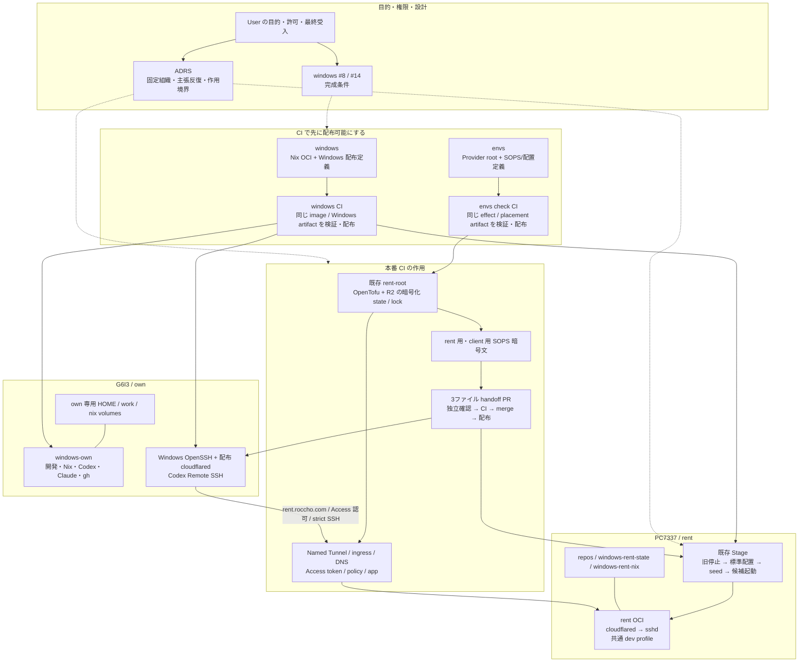
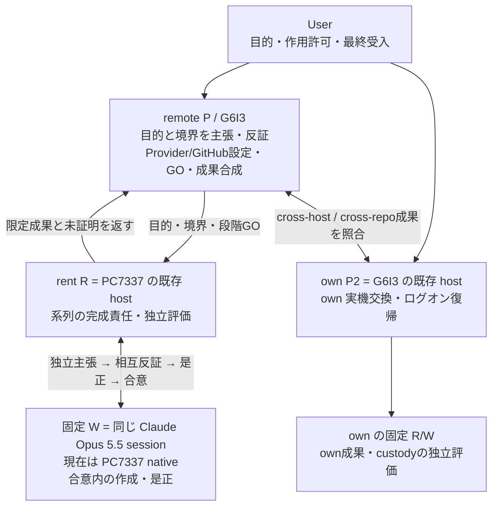
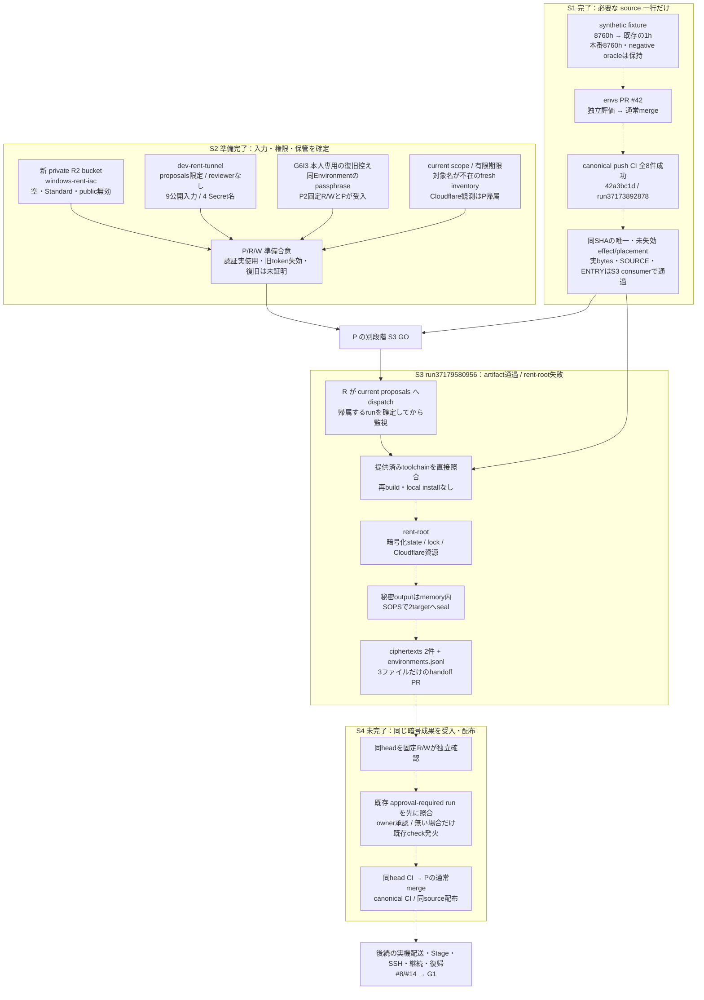
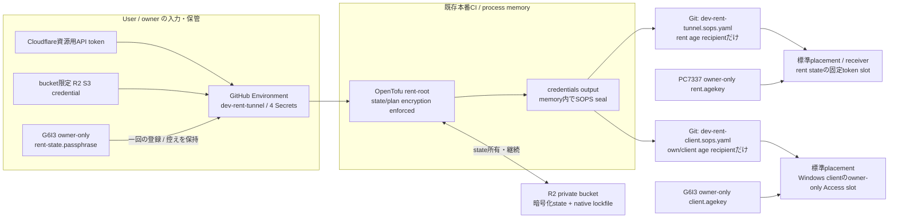
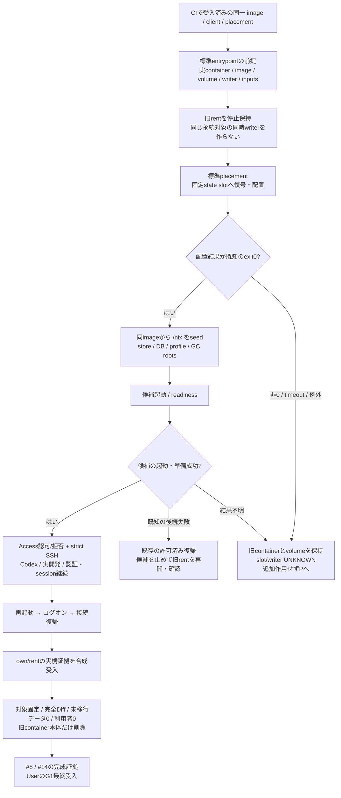

# own / rent の配布・接続・移行

## この文書の位置づけ

G6I3 を own/head として、PC7337 の rent をこの端末から開発・制御するための全体図と設計理由を記録する。関連する目的は [windows #8](https://github.com/roccho-dev/windows/issues/8) と [#14](https://github.com/roccho-dev/windows/issues/14) にある。

これは説明用の正本であり、実行許可や runtime の正本ではない。役割・許可は [ADRS #525](https://github.com/roccho-dev/adrs/pull/525) の canonical `701e76e6f1ac0c87fddda01fc4167f62d6cfd726`、特に `policy/control.jsonl` の row272（本番系列 v39）と row273（state 鍵保管）に従う。製品の実装は各 repository、現在の合意と証拠は対象 PR に置く。同じ図を各 repository や PR に複写しない。

**観測基準日は 2026-10-04。図の「完了」は下表の限定範囲だけを示す。** source の受入、Provider の適用、実機の成功、全体の受入を混同しない。ここに書いた段階を新しい実行前チェック列にしない。

## 1. 目的と完成形

ユーザーが求める状態は次のとおり。

- G6I3 が own/head、PC7337 が rent。PC7337 の既存 host R も復旧・制御の経路として使える。
- own/rent の OCI で Codex、Claude Code、Git、gh、Nix と必要な開発 package を使える。package の正本は Nix 定義と CI 配布物に置く。
- rent の外部 SSH は Cloudflare Tunnel / Access を使い、最終 rent OCI から Tailscale・tailscaled・旧認証手順を除く。
- ローカル操作は、配布物の採用、標準の秘密配置、候補起動、疎通、切替・復帰に収める。
- 旧 OCI の必要な状態を引き継ぎ、交換後も実際の開発を継続する。旧 container の削除はその受入後に行う。
- Windows 再起動・ユーザーログオン後も、認証や SSH 設定を作り直さず接続を復帰できる。



own OCI と Windows SSH client は別の実行面である。rent の本番接続は Windows client と rent OCI の両側を実証する。own のローカル Remote SSH 成功だけで rent の成功を主張しない。

## 2. 背景と、この形に至った理由

| 背景・観測 | 採用した判断 | 維持する限界 |
|---|---|---|
| 当初は Windows/OCI の基盤、own、dev、rent、Windows 配布が別 PR で進んだ | merge commit で基盤と各系列を取り込み、単一 CI へ合成した。必要な系列の履歴と検査を保つ | コード統合だけでは実機移行・認証・G1 は完成しない |
| Tailscale のブラウザー承認後も daemon が `NeedsLogin` のままになり、URL再利用や一時キーでは netmap 受信を実証できなかった | #14 を Cloudflare の完成形へ改め、Tailscale を最終 rent に残さない | 特定の失敗原因や、別方式なら必ず成功することは証明していない |
| exact な手入力契約、Base64 transport、ローカルの鍵移送・receipt・手動 hash gate が増え、no-effect 停止が続いた | 再利用する標準経路へ不足を戻す。CI 配布物を直接検証する既存 consumer に寄せ、ローカルの独自手順を増やさない | Provider と実機でしか確認できないことは残る。事前 CI がそれらの成功を保証するわけではない |
| 旧 own の Xpra display 100 失敗が exit23 を起こし、SSH まで止めた | Xpra を完成形から除き、SSH の起動を不要な headful/Xpra 処理に依存させない | source/CI の修正受入と own 実機交換・ログオン復帰を分ける |
| Noctty から OCI headless Chrome の画面は表示できたが、日本語入力・wheel 等に cdp-tty 側の不足があった | B2 は「画面表示まで」で User 受入済み。cdp-tty の修正は別 Issue の対象とした | 操作全般が完成したとの主張や、Xpra の再採用理由にしない |
| 旧 `envs-dev-mutable` には rootfs 内の作業もあり、named volume があるだけでは保全を証明できなかった | retained container の rootfs と named volume を区別し、旧本体を受入まで保持する | 停止と削除は違う。`envs-*` 全体を名前だけで削除しない |
| rent の HOME 全体を残すと package・資格情報・session の正本が混ざる | HOME は新しく作り、必要状態を型付き state/work/nix へ置く。`dev-home` を最終 rent の mount にしない | 不要とされた旧 settings/skills/plugins を完全移植することを今回の完成条件に戻さない |
| 旧 R2 試験は positive/negative と bucket 不在を確認したが、資格情報終了の期待401に対して403となった | 実結果を保持し、資格情報終了・cleanup/status は UNKNOWN とする。本番系列の専用 backend を別に用意する | 「bucket がない」から「資格情報も終了した」と推定しない。旧試験を自動再発火しない |
| 本番 token の成功 modal が一覧 URL に残り、P の広い画面読取に値が混入した | User が該当 token を同権限・有限期限で再発行し、Secret を更新した。以後は modal 不在と非秘密の表示範囲を先に確認する | 更新時刻は値一致・失効・認証成功の証明ではない。露出の履歴を消さず、旧 token 失効の独立実証は未確認として残す |

VM の保存対象は User が age key のみとし、nixos-vm 退役と保存は完了として受入済み。旧 NixOS 定義を将来 OCI の Nix 定義へ再利用する希望は #8 に残すが、今回の本番系列を止めない。これを rent のデータ削除許可へ拡張しない。

## 3. Nix・Windows 定義・OpenTofu・SOPS・R2 の役割

| 要素 | 正本・責務 | この選択の理由 |
|---|---|---|
| Nix | 共通 dev profile、own/rent OCI、固定 package、effect/placement toolchain、Windows 配布物 | ローカル install の差を減らし、同じ source から検査・配布できる |
| Windows の PowerShell 定義 | 配布物の採用、client 設定、秘密 slot、WSLC の Stage/復帰・ログオン処理 | Windows 固有作用を既存の小さな native adapter に閉じる |
| OpenTofu | `providers/dev-rent-cloudflare/main.tf` の Cloudflare 資源と所有状態 | API 操作を一つの既存 root へ集め、state/lock と対応づける |
| GitHub Environment | 本番 CI の公開入力と User が直接登録する credential、state passphrase | 値を agent に渡さず、許可 branch を `proposals` に限定する |
| R2 | OpenTofu の暗号化 state と native S3 lockfile | 実際に作った資源・秘密・所有状態を継続して管理する backend。既存の標準 S3 backend を使う |
| SOPS / age | rent と client へ渡す、受信先を分けた暗号文 | Git で検査・配布する対象設定を、target の private identity だけで復号できるようにする |

**R2 は GitHub や SOPS の代替ではない。** GitHub には定義と target 向け暗号文、R2 には Provider の暗号化された mutable state を置く。Provider state にも tunnel/client の秘密が入り得るため、`sensitive` 表示だけに頼らず、native state/plan encryption を強制する。

`AWS_ACCESS_KEY_ID` / `AWS_SECRET_ACCESS_KEY` は R2 の S3 互換 backend へ渡す既存の標準名であり、AWS の account を新設する意味ではない。API token は Cloudflare 資源操作用、R2 の S3 credential は専用 bucket の state/lock 用で、用途が異なる。

現在の [Windows common 定義](../hosts/common/README.md) は Nix を選択・pin の正本、PowerShell を activation adapter とする。DSC backend は採用していない。この文書でも「IaC はすべて DSC」とは表現しない。

## 4. 固定組織と合意の意味



合意は、三者が目的を再確認し、独立に主張し、反証と是正を反復して収束した状態を指す。人数、ACK、過去の合意、同じ hash の提示だけでは代替できない。P 自身も主張主体であり、R を単なる報告・伝言役にしない。

R は W の成果と工程を独立に評価し、同じ合意の中で必要な是正と後続工程を進める。目標・権限・作用境界が変わる場合や、結果が UNKNOWN の場合は P へ戻す。待機するたびに User の一般的な「了解」を要求しない。

session は固定する。現在の native W を最終 rent OCI 内の W と同一視しない。最終 OCI での実作業・認証/session 継続と役割引継ぎは runtime 受入で扱い、新 session や actor を黙示追加しない。own P2 の実機作業を remote P/R/W が重複実行しない。

## 5. 本番系列 S1 → S2 → S3 → S4



S1 の fixture 是正は合成検査の不足を埋める最小変更で、実入力や gate を緩める変更ではない。S3 は既存 [project-dev-rent-tunnel.yml](https://github.com/roccho-dev/envs/blob/42a3bc1d3192f0d5049a8c7b962d00e8eb0c66e4/.github/workflows/project-dev-rent-tunnel.yml) を使う。S4 の PR を docs の保存用に拡張しない。

Provider の run 失敗や runner 消失では、PR が作られなくても資源・state・lock が残り得る。自動再実行、import、destroy、rollback、資格情報削除、force-unlock を行わず、非秘密の実際の段階・資源を読んで P が回復境界を判断する。

## 6. 秘密の流れと保管先



| 保管対象 | 正規の場所・利用者 | 確認の範囲 |
|---|---|---|
| state passphrase の控え | G6I3 `C:\Users\resta\AppData\Local\envs\identity\rent-state.passphrase` | 作成時の本人専用ACL、単一生成→本人file→同Environment登録、独立metadata受入済み。実復旧は未証明 |
| state passphrase の CI 入力 | Environment `dev-rent-tunnel` の `RENT_STATE_PASSPHRASE` | GitHub は値を読戻せない。登録の単一process経路と独立metadataを根拠とする |
| rent private age identity | PC7337 の本人領域 `AppData/Local/envs/identity/rent.agekey` | 標準bootstrapの配布元・ACL・public recipient一致を受入済み |
| client private age identity | G6I3 の本人領域 `AppData/Local/envs/identity/client.agekey` | 同上。rent private identityとは共有しない |
| Provider state | account `3d17cd263c27a0ea241f0a8fc09ac2bb` の `windows-rent-iac`、key `cloudflare/windows-rent.tfstate` | 空backendの準備完了。本番暗号化state/lockの作成はS3の実証対象 |
| tunnel/client credential | targetごとのSOPS暗号文から標準slotへ配置 | plaintextをmodel・Issue・PR・argv・log・独自receiptへ出さない |

User の provider credential は Environment へ直接入力する。秘密値・値の hash・断片を agent に渡す経路を設けない。R/W は GitHub の Secret名・更新時刻だけを独立に読む。P の Cloudflare UI観測は P に帰属させ、R/W 自身の直接観測とは記録しない。

有限期限の親credentialと、生成される Access service token の `8760h` は別の寿命である。親credentialは現在 API用が2027-01-03、R2用が2026-11-03まで。毎回ブラウザー認証をやり直す運用を完成形にしないが、期限後の更新・rotationやowner-file復旧が成功済みとも主張しない。

## 7. 完成形の配置と保存する状態

以下は合意済みの完成形と実装上の配置であり、実機への全採用済み一覧ではない。

```text
G6I3 (own/head)
├─ Windows: 配布済み OpenSSH client / cloudflared / client Access slot
├─ AppData/Local/envs/identity/
│  ├─ client.agekey                 private / owner-only
│  └─ rent-state.passphrase          private / owner-only / 復旧控え
└─ windows-own
   ├─ windows-own-home → /home/dev
   ├─ windows-own-work → /work/repos
   │  ├─ <bare>/.worktrees/*         作業directory
   │  └─ .auth/<github-owner>/gh     owner別のgh資格情報
   └─ windows-own-nix → /nix

PC7337 (rent)
├─ 既存 host R / 固定 native Opus W
├─ AppData/Local/envs/identity/rent.agekey   private / owner-only
└─ rent role OCI
   ├─ repos → /work/repos
   │  ├─ <bare>/.worktrees/*
   │  └─ .auth/<github-owner>/gh
   ├─ windows-rent-state → /var/lib/rent
   │  ├─ SSH / Tunnel の型付き状態
   │  └─ dev/{codex,claude,claude.json}     必要なdev継続状態
   ├─ windows-rent-nix → /nix              store / DB / profile / GC roots
   └─ /home/dev                           新規HOME、volume mountなし
```

通常の rent 名は `windows-rent`、既存 Stage の候補実名は `windows-rent-cf`。Stage 成功時は候補を起動し、ログオンtaskもその候補へ向け、旧 `windows-rent` を停止保持する。候補名・role名・現在の実機名を混同しない。最終名まで統一済みとの主張は未実証であり、見た目のためだけの再作成をここで追加しない。

`dev-home` は移行元を読む既存 Migrate の入力としてだけ残り、最終 rent に mount しない。package は HOME に都度 installせず、Nix の固定定義から配布する。Codex/Claude は公式 release を hash固定、gh等は固定nixpkgsを使う。host間で資格情報・session・work・`/nix` を共有しない。

`.auth/<github-owner>/gh` は資格情報の保管rootであり、repositoryのlocal bindingがowner helperを選ぶ。裸repo・worktreeの配置やPATHだけで、別ownerの認証を自動選択したことにしない。[共通 gh 定義](../hosts/profile/gh.nix) と ADRS の Git/authority規則へ従う。

## 8. 実機に残す最小作用と失敗時の境界



これは操作許可ではない。S3/S4のGOから Stage・停止・再起動・削除へ進めることはできない。実機の停止window、他task、current writer、復帰権限をその境界で確定する。

現在の [rent Stage](../hosts/rent/win.ps1) は WSLC が必要なmount情報を示さない場合を保守的に扱い、候補以外のcontainerも provably stopped であることを要求する。目的上の「異なる永続対象なら並行可能」と、現entrypointがそれを判定できることは別である。ここを手動推測や新しいローカルhelperで回避しない。

配置が UNKNOWN なら、旧rentが停止していても勝手に再起動せず、slot/writerを保全して回復判断へ戻す。既知の配置成功後の候補失敗と、配置自体が不明な失敗の復帰を同じものにしない。

削除は受入後に実containerを固定して行う。旧rootfsの追加・変更・削除まで完全に照合できない場合は UNKNOWN。named volumeとimageは削除しない。「envsという名前だから不要」「新しいOCIが存在するから移行完了」という偽陽性を避ける。

## 9. 何が小さく、美しく、高品質なのか

これは評価基準であり、現在の未完了を美化する結論ではない。

| 評価基準 | この構成で達成すること | 膨らませないための制約 |
|---|---|---|
| 正本が一つ | packageはNix、作用は既存entrypoint、目的は#8/#14、role/許可はADRS | 図はこのfileへ集約。独自runtime台帳・並列した設定正本を増やさない |
| 同じ成果物を使う | 検証したsource/image/artifactをそのままconsumerへ渡す | ローカル再build・都度install・手で転記したhashをgateにしない |
| 一つの責務に一つの標準経路 | Providerはrent-root、秘密はSOPS/placement、Windows作用はnative adapter | 新workflow・転送helper・scanner・receipt frameworkを追加しない |
| 変更が目的に直接寄与 | fixture一行と既存production/3-file handoffで閉じる | 意味のないscaffold PR、枝を整えるだけのrebase、完了済み試験の再実行を避ける |
| 状態が明確 | state/work/nixを分け、同じ永続対象のwriterを一つにする | HOME全体の移植、host間の認証共有、rootfsとvolumeの混同をしない |
| 独立性が保たれる | Wが作成・是正、Rが直接評価、Pが境界と合成を評価 | Rを報告役にせず、Pの要約だけでR/Wの読戻しを代用しない |
| 成功と不明を区別 | source / metadata / Provider / runtime / G1 を別の証拠で示す | CI successやSecret名presenceから実認証・SSH・復旧を推定しない |
| 失敗時にさらに小さく戻る | 実物を保持し、不足を定義・CIへ戻して一箇所を直す | UNKNOWNにblind retry、force-unlock、広い削除、恒常復旧helperを重ねない |

Provider運用にはstateの保管、lock、期限更新、target側のprivate identityが必要で、その責務自体は消えない。小ささは、必要な責務を既存の一つの経路に閉じ、同じ不足を各hostで別々に直さないことで評価する。

## 10. 現在の完了・未完了

| 系列・境界 | 担当 | 2026-10-04の現在地 | 残件 |
|---|---|---|---|
| 基盤・単一CI・own/rent/dev/Windows source | 各既存系列、remote P合成 | 統合済み | 実機の完了とは別 |
| B2 表示限定 | own、User受入 | 完了 | IME/wheel等は別scope |
| VM退役・age key保存 | 既存担当、User受入 | 完了 | 再実施しない |
| own image/復帰 source | own P2固定R/W | source/CI受入済み | 実機採用・再起動・ログオン復帰は別受入 |
| S1 本番 fixture/source | rent固定R/W、remote P | PR #42／canonical `42a3bc1d`／push CI全8件で完了 | S3の既存consumerで実bytes照合通過 |
| target age bootstrap | rent固定R/W・own P2固定R/W | 配布元一致・ACL・public recipient一致で完了 | private鍵での本番配置は後続 |
| state passphrase custody | own P2固定R/W、remote P | owner-only fileと同Environment登録を受入済み | 本番使用・実復旧は未証明 |
| S2 入力・backend準備 | remote P、User、rent固定R/W | 9公開入力、4 Secret名、branch制約、権限/有限期限、空backendの準備合意が完了 | 認証実使用、旧tokenの独立失効確認は未証明 |
| S3 本番Provider・暗号handoff生成 | rent R、固定W、remote P | [run37179580956](https://github.com/roccho-dev/envs/actions/runs/37179580956)を一回実行。artifact照合・toolchain通過後、rent-rootで失敗。暗号PR作成はskipped | 閉じたkind/stageと最小是正の特定。state/lock・資源への作用はUNKNOWN。再実行・削除・unlockは未実行 |
| S4 暗号PR受入・配布 | rent固定R/W、remote P | 未完了 | 同head CI、必要owner承認、通常merge、canonical配布 |
| rent 実機の配置・切替・開発継続 | rent host R、固定W | 未実証 | 標準slot、単一writer、認可/拒否、strict SSH/Codex、継続、復帰 |
| 旧OCI整理・work側容量支援 | rent側の既存担当、remote P合成 | 未完了 | 移行実証、完全Diff、利用者0、container本体だけの削除とvolume存続 |
| 旧R2資格情報終了/cleanup | remote P境界 | UNKNOWNを保持 | 新しい作用は別判断。bucket不在だけで閉じない |
| #8 / #14 / G1 | remote P＋own P2、最後はUser | 未完了 | 両系列の実機・拒否・再起動・整理証拠を合成して受入 |
| 旧NixOS定義の将来再利用 | #8で後回し | 要望保持 | 特定・移植は今回の完了を止めない |

S3以後のrunや受入が成立したら、この表と該当図の状態だけを更新する。時系列の実況を追記しない。現在のPRの証拠を参照し、過去の単体CIを新しい合成treeや実機成功へ読み替えない。

## 11. 実体をたどる入口

- [windows #8](https://github.com/roccho-dev/windows/issues/8)：開発継続、状態、writer、旧container整理、G1の目的。
- [windows #14](https://github.com/roccho-dev/windows/issues/14)：Cloudflare接続・認可/拒否・復帰の目的。
- [ADRS #525](https://github.com/roccho-dev/adrs/pull/525)：v39／row272・273の合意と段階別作用境界。
- [envs #40](https://github.com/roccho-dev/envs/pull/40)、[#41](https://github.com/roccho-dev/envs/pull/41)、[#42](https://github.com/roccho-dev/envs/pull/42)：production接続、標準bootstrap、fixture是正とsource証拠。
- [envs canonical check](https://github.com/roccho-dev/envs/actions/runs/37173892878)：`42a3bc1d`の配布元。
- [Provider root](https://github.com/roccho-dev/envs/blob/42a3bc1d3192f0d5049a8c7b962d00e8eb0c66e4/providers/dev-rent-cloudflare/main.tf)、[既存production workflow](https://github.com/roccho-dev/envs/blob/42a3bc1d3192f0d5049a8c7b962d00e8eb0c66e4/.github/workflows/project-dev-rent-tunnel.yml)：資源・native backend・暗号化・3-file handoff。
- [windows #45](https://github.com/roccho-dev/windows/pull/45)、[#47](https://github.com/roccho-dev/windows/pull/47)：own配布とrentの標準Stage。現在の関連実装は [flake.nix](../flake.nix)、[rent Windows entry](../hosts/rent/win.ps1)、[client ProxyCommand](../hosts/common/rent-access.ps1)、[owner gh binding](../hosts/profile/gh.nix)。

この文書の追加は docs 一件だけで、上記source、credential、Provider、host/OCIの作用を変更しない。
